<h1 align="center">🛰️ SuperVision</h1>

<div align="center">
  <strong>A New Dimension of Clarity</strong><br>
  Super-Resolution Empowered Object Detection in Remote Sensing Imagery
</div>

<br>

## 💡 Overview

**SuperVision** is a research-driven project that integrates **Super-Resolution Generative Adversarial Networks (SRGAN)** with **YOLOv8-Oriented Bounding Boxes (OBB)** to improve object detection performance in **low-resolution remote sensing imagery**.

This novel pipeline enhances visual clarity before detection, allowing the model to identify objects more precisely, even in noisy or downsampled satellite/aerial images.

---

## 🔍 Research Motivation

- Remote sensing imagery often suffers from **low spatial resolution**, which limits detection accuracy.
- Traditional object detectors struggle with small or blurred objects in satellite images.
- Solution: Apply **image super-resolution** before detection to bridge the resolution gap.

---

## 🛠️ Methodology

1. **Super-Resolution**  
   - Used **SRGAN** to upscale low-resolution satellite images.
   - Restores texture and fine details lost during downsampling.

2. **Object Detection**  
   - Applied **YOLOv8 with Oriented Bounding Boxes (OBB)**.
   - Trained to detect and localize rotated objects commonly found in remote sensing datasets (DOTA).

3. **Pipeline**

```mermaid
graph TB
    %% Input Layer
    Input[📡 Low-Resolution<br/>Remote Sensing Image]
    
    %% Frontend Processing
    Upload[🌐 React Client<br/>Image Upload Interface]
    Auth[🔐 Express.js Server<br/>JWT Authentication]
    
    %% AI Processing Pipeline
    FastAPI[⚡ FastAPI Server<br/>Model Inference API]
    
    %% Super-Resolution Stage
    SRGAN[🎯 SRGAN Model<br/>Super-Resolution<br/>Enhancement]
    Enhanced[✨ Enhanced Image<br/>High-Resolution<br/>Restored Details]
    
    %% Object Detection Stage
    YOLO[🎯 YOLOv8 OBB<br/>Object Detection<br/>DOTA v2 Trained]
    Detection[📊 Detection Results<br/>Oriented Bounding Boxes<br/>Class Predictions]
    
    %% Post-Processing
    Visualize[📈 Results Visualization<br/>Annotated Images<br/>Detection Metrics]
    
    %% Storage Layer
    ImageDB[(💾 Image Storage<br/>Original & Enhanced)]
    ResultDB[(📁 MongoDB<br/>User Data & Results)]
    
    %% Data Flow
    Input --> Upload
    Upload --> Auth
    Auth --> FastAPI
    FastAPI --> SRGAN
    SRGAN --> Enhanced
    Enhanced --> YOLO
    YOLO --> Detection
    Detection --> Visualize
    Visualize --> Upload
    
    %% Storage Connections
    FastAPI --> ImageDB
    FastAPI --> ResultDB
    Auth --> ResultDB
    
    %% Styling
    classDef input fill:#e3f2fd,stroke:#1976d2,stroke-width:2px
    classDef frontend fill:#f3e5f5,stroke:#7b1fa2,stroke-width:2px
    classDef ai fill:#e8f5e8,stroke:#388e3c,stroke-width:2px
    classDef storage fill:#fff3e0,stroke:#f57c00,stroke-width:2px
    classDef results fill:#fce4ec,stroke:#c2185b,stroke-width:2px
    
    class Input input
    class Upload,Auth frontend
    class FastAPI,SRGAN,Enhanced,YOLO ai
    class ImageDB,ResultDB storage
    class Detection,Visualize results
```



### 🔄 Detailed Pipeline Workflow

#### **Stage 1: Image Preprocessing**
- **Input**: Low-resolution satellite/aerial imagery
- **Authentication**: User login via JWT tokens
- **Upload**: Secure image upload through React interface

#### **Stage 2: Super-Resolution Enhancement**
- **SRGAN Processing**: 
  - Upscales images by 4x factor
  - Restores fine-grained details and textures
  - Reduces noise and artifacts
- **Output**: High-resolution enhanced imagery

#### **Stage 3: Object Detection**
- **YOLOv8 OBB Processing**:
  - Detects objects in enhanced images
  - Generates oriented bounding boxes
  - Classifies objects based on DOTA v2 categories
- **Classes Detected**: Ships, vehicles, planes, bridges, storage tanks, etc.

#### **Stage 4: Results Processing**
- **Visualization**: Annotated images with detection results
- **Metrics**: Confidence scores, bounding box coordinates
- **Storage**: Results saved to MongoDB for future reference

### 🏗️ System Architecture

```
┌─────────────────┐    ┌─────────────────┐    ┌─────────────────┐
│   React Client  │────│  Express.js     │────│    MongoDB      │
│   (Frontend)    │    │  (Auth Server)  │    │  (User Data)    │
└─────────────────┘    └─────────────────┘    └─────────────────┘
         │                                              │
         │                                              │
         ▼                                              ▼
┌─────────────────┐    ┌─────────────────┐    ┌─────────────────┐
│  FastAPI Server │────│     SRGAN       │────│  Image Storage  │
│  (AI Backend)   │    │  (Enhancement)  │    │  (File System)  │
└─────────────────┘    └─────────────────┘    └─────────────────┘
         │
         ▼
┌─────────────────┐
│   YOLOv8 OBB    │
│  (Detection)    │
└─────────────────┘
```

---


## 🎯 Performance Benefits

- **Enhanced Detection Accuracy**: Super-resolution improves small object detection
- **Reduced False Negatives**: Better visibility of obscured or low-contrast objects
- **Improved Localization**: More precise bounding box predictions
- **Scalable Architecture**: Microservices design for easy deployment and scaling

---

## 🛡️ Technical Stack

### **Frontend**
- **React.js**: Modern UI framework
- **Material-UI**: Component library for professional design

### **Backend Services**
- **Express.js**: Authentication and session management
- **FastAPI**: High-performance AI model serving
- **MongoDB**: NoSQL database for user data and results

### **AI Models**
- **SRGAN**: Super-resolution image enhancement
- **YOLOv8 OBB**: Object detection with oriented bounding boxes
- **DOTA v2**: Training dataset for remote sensing object detection

---

## 📈 Research Impact

This project demonstrates the effectiveness of combining super-resolution with object detection for remote sensing applications, potentially improving:

- **Satellite Image Analysis**: Better object identification in low-resolution imagery
- **Enhanced Image for Warfare Systems**: Better Object Detection for drone based cameras during War Situations
